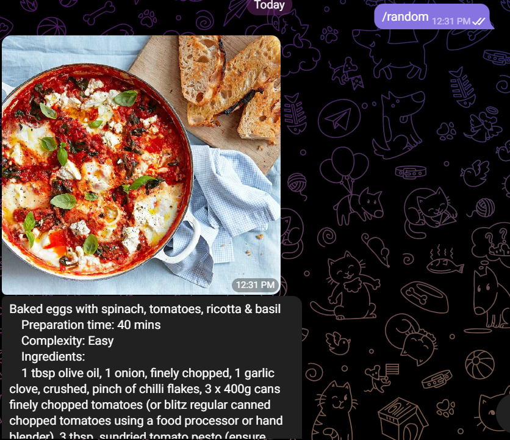

# RecipeBot

## About
Telegram bot which gets a random recipe for you.
If you want some specialized recipe, you can use filters mode.

## How to use
It is telegram bot, so the only thing you need to have to use it is - telegram account.

1. Open the [bot](https://t.me/recipea_bot)
2. Enter the /start command to begin working with the bot

3. Choose the options /random or /filters

4. - If you chose /random you will get a random recipe from a database

   - If you chose / filters you will open the filters menu, where you should choose your filters
   

5. Choose an option you want to choose a filter for (Ingredients, Time or Complexity)
6. 1. For ingredients you should enter all ingredients you want, divided with commas
   2. For time you should enter amount of minutes you want
   3. For complexity you should choose an avaliable option

## Issues
If you are using telegram.web version and can't see the buttons, you can try opening them by clicking the button shown on the picture below

